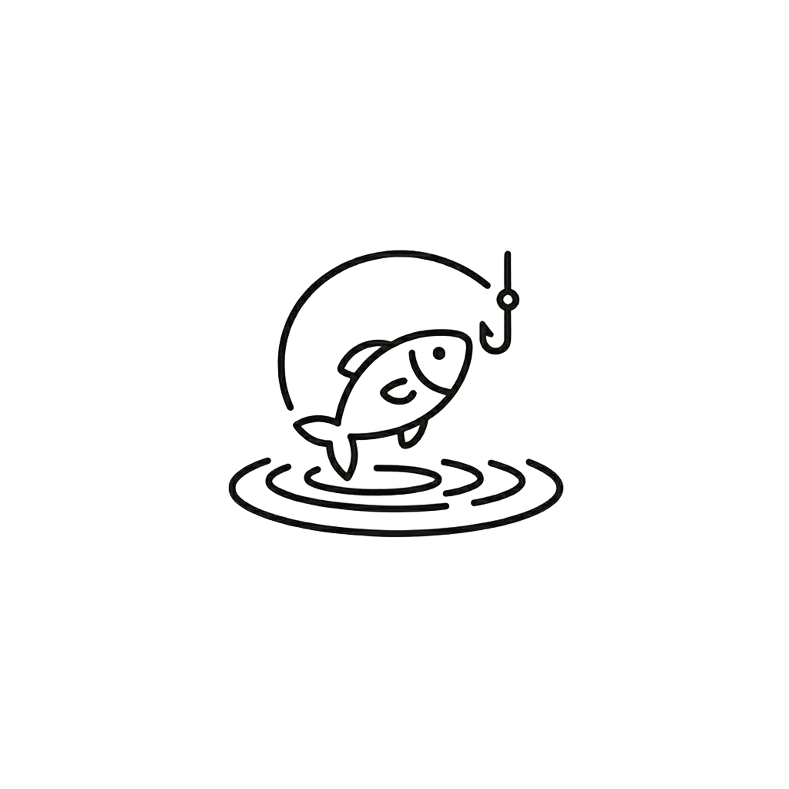
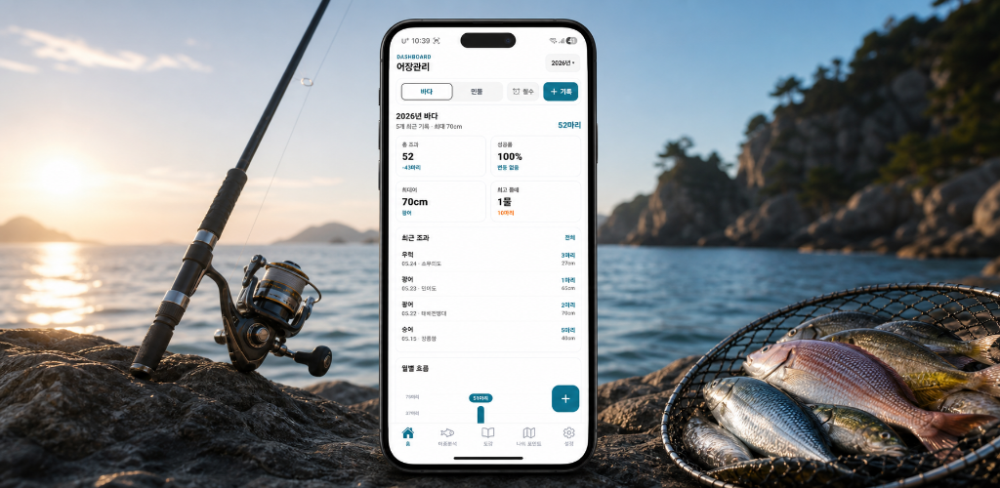
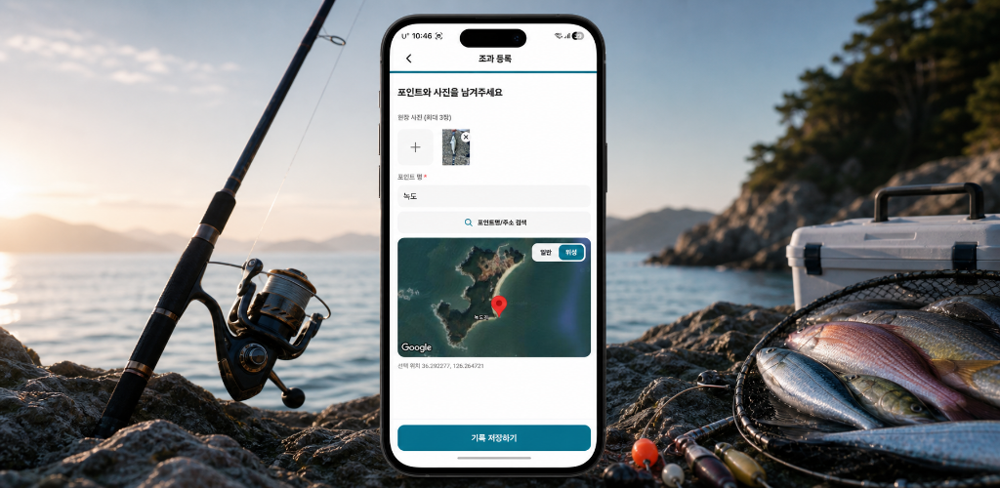
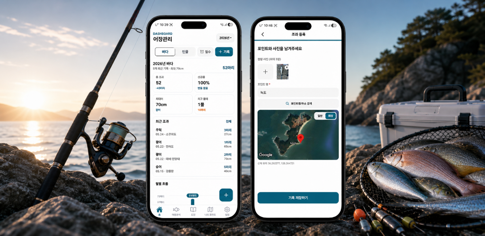

# 어장관리

<p align="center">
  
</p>

<p align="center">
  낚시 조과를 사진, 위치, 물때, 날씨, 어종 데이터와 함께 구조화해서 기록하는 React Native Expo 앱
</p>

<p align="center">
  
  
  
  
</p>

## 소개

어장관리는 낚시 후 흩어지기 쉬운 조과 정보를 정확하게 남기기 위한 모바일 앱입니다. 1차 MVP는 "내 조과를 정확히 등록하는 것"에 집중하며, 조과 사진과 함께 날짜, 위치, 물때, 날씨, 어종, 마릿수, AI 판별 결과를 저장합니다.

통계 화면은 MVP의 핵심 범위에서 분리했지만, 향후 물때별 조과, 어종별 누적 기록, 포인트별 성과를 계산할 수 있도록 Supabase 스키마와 앱 타입을 구조화했습니다.

## 주요 기능

| 기능 | 설명 |
| --- | --- |
| 조과 기록 | 바다/민물, 출조 날짜, 어종, 마릿수, 크기, 위치, 물때, 날씨, 메모를 입력하고 수정합니다. |
| 사진 기반 등록 | 사진 1장을 선택하면 EXIF 촬영일시/GPS, AI 어종 후보, 환경 데이터를 조과 초안에 반영합니다. |
| 위치/사진 저장 | 조과 이미지는 Supabase Storage에 저장하고, 위치 좌표는 지도/EXIF/GPS 출처와 함께 관리합니다. |
| AI 어종 판별 | Supabase Edge Function에서 Gemini API를 호출해 어종 후보와 confidence를 반환합니다. |
| 누적 요약 | 홈에서 연도/낚시 종류별 총 조과, 성공률, 월별 추이, 좋은 물때를 계산합니다. |
| 어종 도감/규정 | 잡은 어종을 도감 형태로 해금하고, AI 분석 결과와 어종별 금어기/금지 체장 정보를 함께 보여줍니다. |
| 안전 알림 | 30분 뒤, 1시간 뒤, 2시간 뒤, 직접 선택 방식으로 철수 알림을 예약/취소합니다. |

## 스크린샷

> `store-assets`의 스토어용 이미지를 README 미리보기로 사용합니다.

| 홈 요약 | 조과 등록 | 주요 화면 |
| --- | --- | --- |
|  |  |  |

## Tech Stack

| 영역 | 기술 |
| --- | --- |
| App | React Native, Expo, Expo Router, TypeScript |
| 상태 관리 | React Query, React Hook Form, React state |
| Backend | Supabase Auth, Supabase Postgres, Supabase Storage, Supabase Edge Functions |
| AI/자동화 | Gemini API, 이미지 압축, EXIF 정규화, 바다낚시지수/날씨 예보 Edge Function |
| Native | expo-image-picker, expo-location, expo-notifications, react-native-maps |
| Analytics/수익화 | Firebase Analytics, 광고 슬롯 설계 |
| Test | Jest, jest-expo |

## 핵심 구현 포인트

### 1. 인증/RLS/Storage 접근 제어

- Supabase Auth 세션을 기준으로 조과 기록과 이미지에 `user_id = auth.uid()` RLS 정책을 적용했습니다.
- `catch-images` Storage bucket은 private으로 만들고, `users/{userId}/...` 경로 규칙으로 사용자별 객체 접근을 제한했습니다.
- 조과 목록/상세 화면은 컴포넌트에서 Supabase client를 직접 호출하지 않고 `api/` 함수와 React Query hook을 통해 접근합니다.

근거 파일: `supabase/migrations/20260427110000_create_catch_logs_and_images.sql`, `api/catch-logs.ts`, `hooks/queries/use-catch-logs.ts`

### 2. 등록 폼과 저장 입력값 분리

- 화면 입력값은 React Hook Form으로 관리하고, 저장 직전 `utils/catch-register-form.ts`에서 API 입력 타입으로 정규화합니다.
- 직접 입력, 수정, 사진 초안 prefill, 신규/기존 이미지 구분을 같은 변환 계층에서 처리합니다.
- 숫자/날짜/어종/사진 메타데이터 변환은 테스트로 검증합니다.

근거 파일: `app/catch-register/index.tsx`, `utils/catch-register-form.ts`, `utils/catch-register-form.test.ts`

### 3. AI 이미지 비용 최적화

- AI 분석과 사진 초안 생성 전에 로컬 이미지를 긴 변 2048px, JPEG quality 0.82로 압축합니다.
- 앱에는 Gemini API key를 넣지 않고, Supabase Edge Function secret으로만 사용합니다.
- Edge Function에서는 사용자 소유 이미지 경로를 검증하고, Gemini 응답의 token usage와 후보 결과를 `ai_species_predictions`에 저장합니다.

근거 파일: `utils/image-compression.ts`, `api/ai-species.ts`, `api/photo-catch-draft.ts`, `supabase/functions/detect-fish-species/index.ts`, `supabase/migrations/20260501090000_create_ai_species_predictions.sql`

### 4. 통계가 가능한 데이터와 테스트

- 조과 기록은 `fishing_date`, `species_id`, `tide`, `weather`, `location`, `water_type`, 환경 수치 데이터를 분리된 컬럼으로 저장합니다.
- 홈 요약은 총 마릿수, 성공률, 월별 추이, 좋은 물때를 순수 함수로 계산하고 Jest로 검증합니다.
- EXIF 날짜/GPS 정규화와 물때 날짜 입력 유틸도 테스트로 보호합니다.

근거 파일: `utils/home-stats.ts`, `utils/home-stats.test.ts`, `utils/photo-exif.ts`, `utils/photo-exif.test.ts`, `utils/tide.ts`, `utils/tide.test.ts`, `supabase/migrations/20260518195419_add_catch_environment_fields.sql`

## 실행 방법

```bash
npm install
npm start
```

Android 개발 빌드:

```bash
npm run android
```

iOS 개발 빌드:

```bash
npm run ios
```

웹 미리보기:

```bash
npm run web
```

## 환경 변수

`.env.example`을 기준으로 `.env`를 만들어 사용합니다.

```bash
EXPO_PUBLIC_SUPABASE_URL=""
EXPO_PUBLIC_SUPABASE_PUBLISHABLE_KEY=""
EXPO_PUBLIC_GOOGLE_MAPS_ANDROID_API_KEY=""
EXPO_PUBLIC_KAKAO_REST_API_KEY=""
```

Supabase Edge Function secret은 모바일 앱 번들에 넣지 않습니다.

```bash
GEMINI_API_KEY=""
KMA_SERVICE_KEY=""
PUBLIC_DATA_PORTAL_SERVICE_KEY=""
ACCOUNT_DELETE_PURGE_SECRET=""
SUPABASE_SERVICE_ROLE_KEY=""
```

## 테스트

```bash
npm test
npm run lint
npx --no-install tsc --noEmit
```

주요 테스트:

- `utils/home-stats.test.ts`: 홈 통계 계산, 물때별 성과, 연도/낚시 종류 필터
- `utils/catch-register-form.test.ts`: 등록/수정 입력값 정규화, AI 추천 어종, 이미지 입력 변환
- `utils/photo-exif.test.ts`: EXIF 촬영일시/GPS 정규화
- `utils/tide.test.ts`: 출조 날짜 입력 포맷/검증

## 폴더 구조

```text
app/              Expo Router 화면과 layout
api/              Supabase service 함수와 외부 API wrapper
hooks/queries/    React Query hook
hooks/            일반 custom hook
components/       재사용 UI 컴포넌트
constants/        색상, query key, 정책, 고정값
types/            도메인 타입과 DTO 타입
utils/            폼 변환, 통계, EXIF, 날짜 유틸
assets/           앱 아이콘, 로고, 도감 이미지, 사운드
store-assets/     스토어/README용 이미지
supabase/         migration, Edge Functions, Supabase 설정
doc/              MVP 범위, 아키텍처, UX, Supabase 설계 문서
```

## Supabase 설계 근거

- `supabase/migrations/`: 테이블, RLS, Storage bucket, 인덱스, seed 변경 이력
- `supabase/functions/detect-fish-species`: AI 어종 판별
- `supabase/functions/create-photo-catch-draft`: 사진 기반 조과 초안 생성
- `supabase/functions/sync-fishing-index`: 바다낚시지수 동기화
- `supabase/functions/sync-weather-forecast`: 날씨 예보 동기화
- `supabase/functions/delete-account`, `restore-account`, `purge-deleted-accounts`: 30일 복구 기간 기반 계정 삭제 흐름

## 문서

- 프로젝트 개요: `doc/jogwalog-agent/project-brief.md`
- MVP 범위: `doc/jogwalog-agent/mvp-scope.md`
- 화면 플로우: `doc/jogwalog-agent/screen-flow.md`
- 아키텍처: `doc/jogwalog-agent/architecture.md`
- Supabase 백엔드: `doc/jogwalog-agent/supabase.md`
- 사진으로 등록: `doc/jogwalog-agent/photo-catch-log.md`
